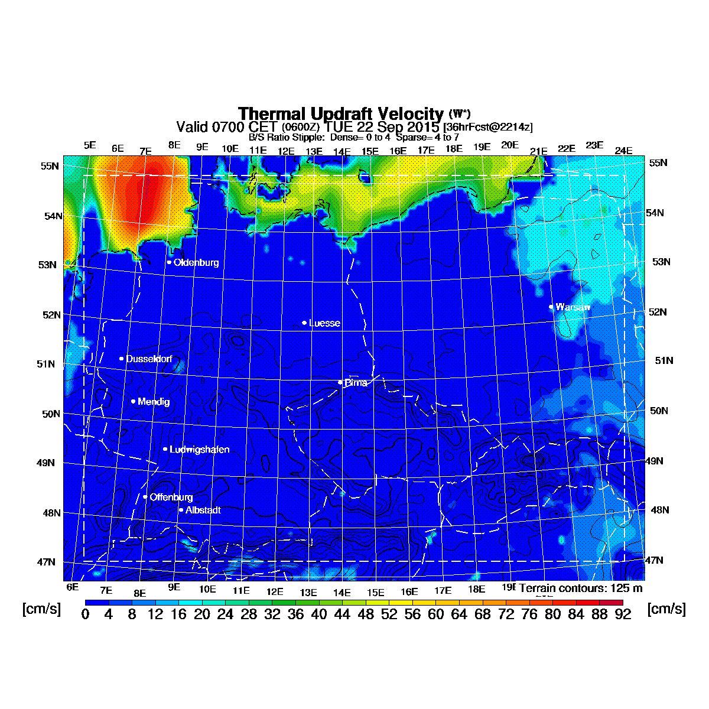

# rrasp
Regional Atmospheric Soaring Prediction as a gif (Germany and surroundings).

## Setup

You have to install [ImageMagick](http://www.imagemagick.org/script/index.php).

## Available parameters

* Cu Cloudbase where Cu Potential>0
* Thermal Updraft Velocity and B/S ratio
* BL Avg. Wind
* OD Cloudbase where OD Potential>0

## Run (examples)

Get info about tomorrow (Cu Cloudbase where Cu Potential>0)
```sh
$ cargo run -- --parameter "Cu Cloudbase where Cu Potential>0" --when tomorrow
```


Get info about today (BL Avg. Wind)
```sh
$ cargo run -- --parameter "BL Avg. Wind" --when tomorrow
```

## Example output

